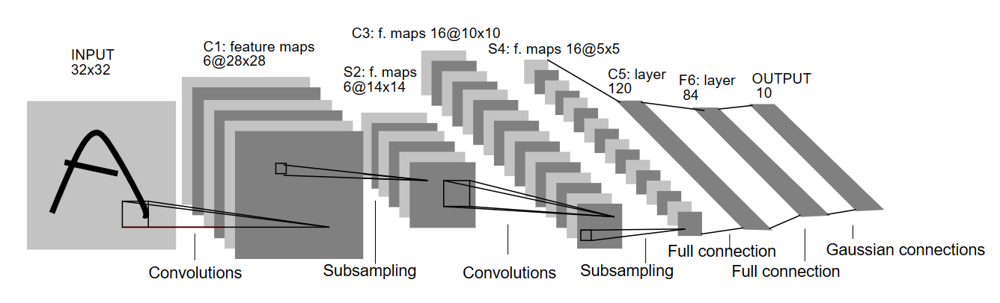

# Pytorch_LeNet_MNIST 
切换语言：[[简体中文](./assets/README-中文.md)]



## Environment

We use `conda` to create virtual environment.

```sh
conda create -n pytorch python=3.8
conda activate pytorch
```

Install pytorch according to your CUDA version. Refer to https://pytorch.org/get-started/locally/ for more specifc installation steps.

For example, for a linux server with CUDA 11.3, use the following command:

```sh
pip install torch==1.12.1+cu113 torchvision==0.13.1+cu113 torchaudio==0.12.1 --extra-index-url https://download.pytorch.org/whl/cu113
```

Install basic packages:

```sh
pip install numpy
pip install matplotlib
pip install wandb       # if you want to use wandb for output log
```

## Code Structure

```txt
Pytorch_LeNet_MNIST
|-- assets
|-- data
|   |-- build_data.py   # Load training data (MNIST here)
|-- model
|   |-- lenet.py        # define model (Lenet here)
|-- README.md
|-- main.py             # main function
---------------------------------------
|-- checkpoints         # for output model checkpoints
|-- downloads           # downloaded dataset path
|-- logs                # output logs
```

## Usage

Firstly, clone this repo:
```sh
https://github.com/Mr-Philo/Pytorch_LeNet_MNIST.git
cd Pytorch_LeNet_MNIST
```

To train model (for example):
```sh
python main.py --batch-size 64 --epoch 30 --lr 0.005 --optim 'sgd'
```


Use following command with argparse to control the parameters:
```sh
python main.py
    --data-path: path to dataset (default='./downloads/')
    --batch-size: batch size for single GPU (default=128)
    --epoch: set epoches for training (default=10)
    --lr: set learning rate for training (default=0.001)
    --optim: set optimizer for training. choose between sgd, momentum, RMSprop, adam (default='adam')
    --eval: Perform evaluation only
    --checkpoint: Path to checkpoint for evaluation (default='./checkpoints/model.pth')
    --use-wandb: use wandb to record log
    --name: The name of wandb job (default='lenet-MNIST')
```

By default, the model checkpoint will be stored in `./checkpoints/model.pth`, and the output log will be stored in `./logs`. You could modify them in argparse or simply replace them in the code.

To evaluate model:
```sh
python main.py --eval --checkpoint <path-to-model-checkpoint>
```