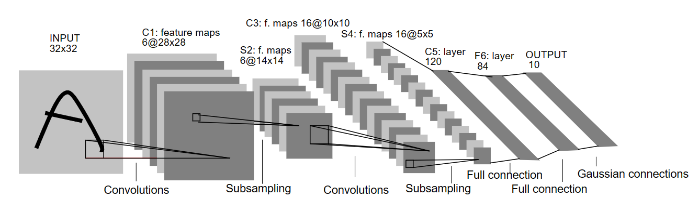

# 利用Pytorch实现LeNet进行手写数字识别
Switch Language: [[English](../README.md)]



## 配置环境

我们使用`conda`来创建一个名为`pytorch`的虚拟环境

```sh
conda create -n pytorch python=3.8
conda activate pytorch
```

接下来，根据机器的CUDA版本安装Pytorch。参考Pytorch官网 https://pytorch.org/get-started/locally/ 来获取更加详细的安装命令（不同操作系统、CPU/GPU版本、不同CUDA版本等）

比如，在一个CUDA11.3版本的Linux机器上，运行下列命令来安装Pytorch:

```sh
pip install torch==1.12.1+cu113 torchvision==0.13.1+cu113 torchaudio==0.12.1 --extra-index-url https://download.pytorch.org/whl/cu113
```

安装基本的依赖包:

```sh
pip install numpy
pip install matplotlib
pip install wandb       # 使用wandb来查看输出曲线图
```

## 代码结构

```txt
Pytorch_LeNet_MNIST
|-- assets
|-- data
|   |-- build_data.py   # 用来加载数据集的函数，这里用的是MNIST
|-- model
|   |-- lenet.py        # 定义了模型结构，这里用的是Lenet
|-- README.md
|-- main.py             # 主函数
---------------------------------------
|-- checkpoints         # 训练好的模型文件保存的路径
|-- downloads           # 下载好的数据集所存路径
|-- logs                # 输出日志文件
```

## 使用方法

首先将此代码库克隆至本地:
```sh
https://github.com/Mr-Philo/Pytorch_LeNet_MNIST.git
cd Pytorch_LeNet_MNIST
```

举例：训练模型（使用64的batchsize，一共30个epoch，学习率0.005，优化器使用随机梯度下降SGD）
```sh
python main.py --batch-size 64 --epoch 30 --lr 0.005 --optim 'sgd'
```


使用命令行参数，来控制训练过程中的各个参数细节:
```sh
python main.py
    --data-path: 数据集路径 (默认为'./downloads/')
    --batch-size: 每次批训练的大小 (默认为128)
    --epoch: 设置一共训练多少个epoch (默认为10)
    --lr: 设置训练过程中的学习率 (默认为0.001)
    --optim: 设置训练过程中的优化器，在'sgd', 'momentum', 'RMSprop', 'adam'中选择 (默认为'adam')
    --eval: 只进行评估而不训练
    --checkpoint: 若只评估，则使用该选项指定待评估的模型的路径 (默认为'./checkpoints/model.pth')
    --use-wandb: 使用wandb来记录输出曲线
    --name: 若使用wandb，则使用该选项来指定wandb任务的名字 (默认为'lenet-MNIST')
```

训练好的模型会被默认保存至`./checkpoints/model.pth`, 输出日志会被默认保存至`./logs`. 你可以利用命令行参数修改保存路径，也可以直接在代码中修改。

评估模型：
```sh
python main.py --eval --checkpoint <path-to-model-checkpoint>
```