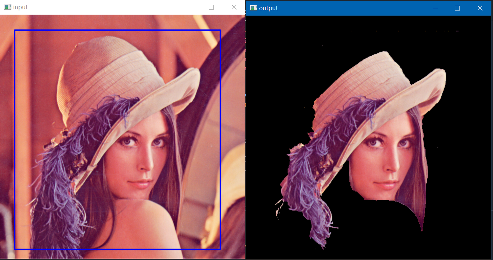
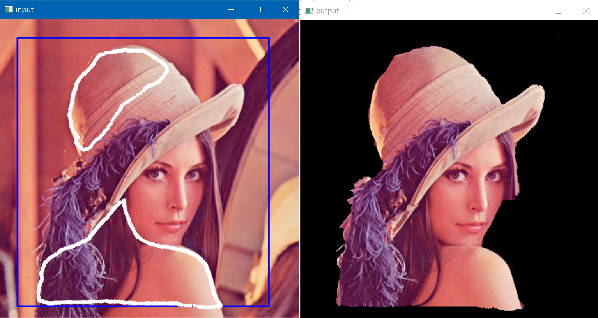
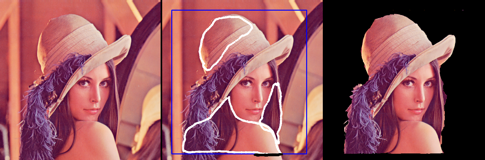
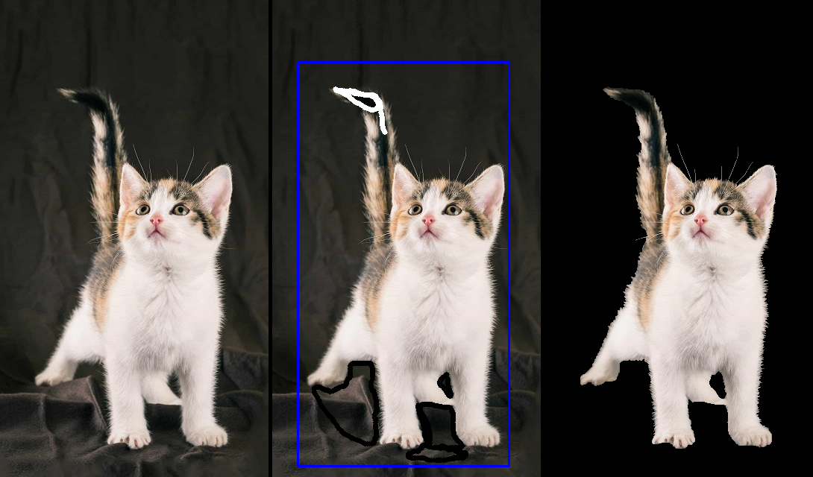
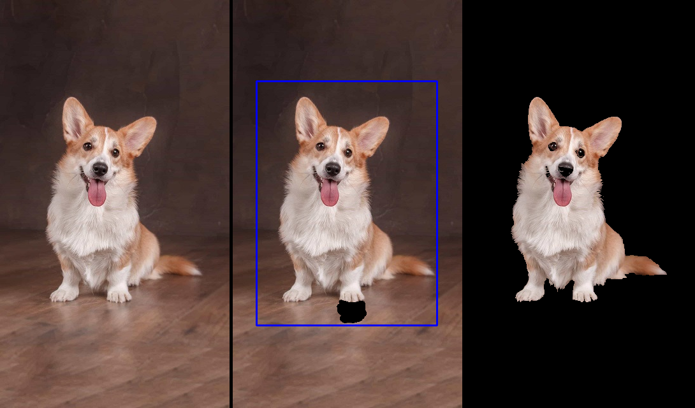
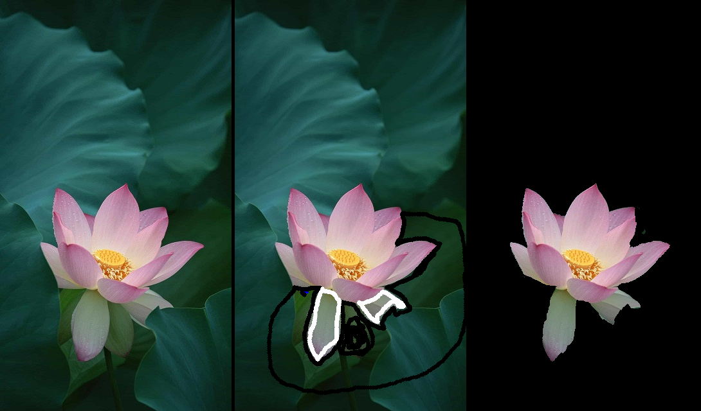
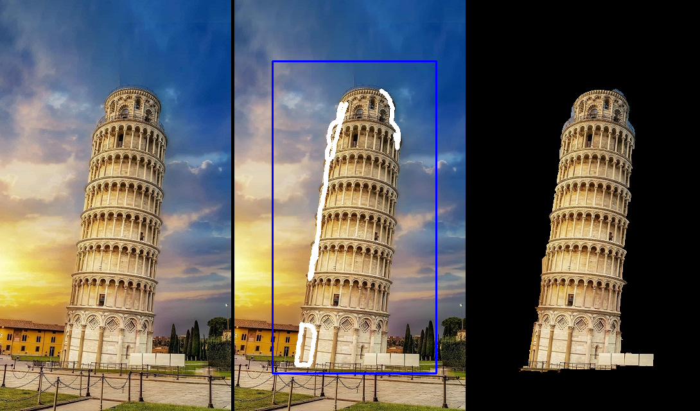
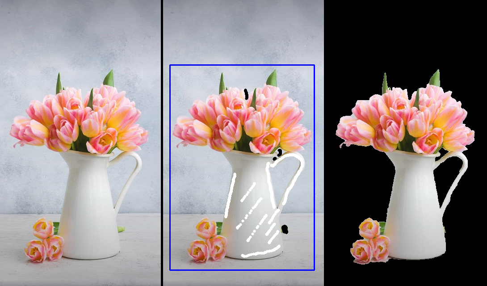

# 实验五 GrabCut静态图像分割方法

PB19071509 王瑞哲


## >>> 实验目标

复现GrabCut静态图像分割算法


## >>> 实验原理

GrabCut利用迭代的graph cut进行交互式前景提取。能够实现对静态图像高效的、交互的前景背景分割，对于图像编辑有非常重要的现实意义。当前景和背景颜色比较相似的时候，相似的部分可能难以分割出来。这时候可以利用前/背景画刷进行交互，达到更理想的抠图效果。

本次实验的GrabCut算法实现流程大致分为以下几步：

- 根据用户输入，对图像做合理分割；
- 对前景、背景分别利用K-Means算法初始化一个高斯混合模型GMM；
- 对各像素计算GMM中最可能的高斯分量，并更新GMM；
- 创建图，执行min cut算法产生新的像素分割。

具体的算法步骤和实验代码原理，在下一部分中详细阐述。


## >>> 实验过程

#### 1. 代码构筑

```
exp5
|-- grabcut.py
|-- utils
	|-- GrabModel.py
	|-- GMM.py
```

其中`grabcut.py`为主函数，定义了opencv交互的界面，与示例代码中的`grabcut.py`完全一致，只在`_grabCut`函数中调用了自己编写的Grabcut函数，并import对应的类：`from utils.GrabModel import My_GrabCut`

本次所编写的函数均放进了`utils`文件夹中。其中`GrabModel.py`定义了使用GrabCut算法的全过程，包括分割、初始化GMM模型、建图、计算等一系列流程；`GMM.py`沿用实验四所编写的GMM类函数，定义了关于GMM模型的各种计算函数等。

#### 2. 初始化与类定义

本次实验中，调用GrabCut算法的语句为：

```py
def _grabCut(self, img2, mask, rect, bgdmodel, fgdmodel, iterCount, mode):
    self.mask = My_GrabCut(img2, mask, rect, iterCount, mode).exec()
```

所执行的`My_GrabCut`类算法为：

```py
class My_GrabCut:

    # Basic settings align with main grabcut.py
    BLUE = [255,0,0]        # rectangle color
    RED = [0,0,255]         # PR BG
    GREEN = [0,255,0]       # PR FG
    BLACK = [0,0,0]         # sure BG
    WHITE = [255,255,255]   # sure FG
    
    DRAW_BG = {'color' : BLACK, 'val' : 0}
    DRAW_FG = {'color' : WHITE, 'val' : 1}
    DRAW_PR_BG = {'color' : RED, 'val' : 2}
    DRAW_PR_FG = {'color' : GREEN, 'val' : 3}

    # init (align with grabcut func)
    def __init__(self, img, mask, rect, iterCount=1, mode=cv.GC_INIT_WITH_RECT, gmm_components=5):
        # Basic statements
        self.img = np.asarray(img, dtype=np.float64)
        self.rows, self.cols, _ = img.shape
        self.iterCount = iterCount
        self.mode = mode

        self.mask = mask
        if mode == cv.GC_INIT_WITH_RECT:        # only done when mode == cv.GC_INIT_WITH_RECT
            self.mask[rect[1]:rect[1] + rect[3],
                      rect[0]:rect[0] + rect[2]] = self.DRAW_PR_FG['val']
        self.classify_pixels()

        self.bgd_gmm = None
        self.fgd_gmm = None
        self.comp_idxs = np.empty((self.rows, self.cols), dtype=np.uint32)
        self.gmm_components = gmm_components    # choose 5 for num_of_Gaussian_model
        self.gamma = 50                         # choose 50 for gamma
        self.beta = 0

        self.left_V = np.empty((self.rows, self.cols - 1))
        self.upleft_V = np.empty((self.rows - 1, self.cols - 1))
        self.up_V = np.empty((self.rows - 1, self.cols))
        self.upright_V = np.empty((self.rows - 1, self.cols - 1))

    def exec(self):
        # Basic funtions of computing GrabCut algorithm
        self.init_GMMs()
        num_iters = self.iterCount
        for _ in range(num_iters):
            self.assign_GMMs_components()
            self.learn_new_GMMs()
            self.graph_construction()
        return self.mask
```

其中`self.mask`指示了对图像上所有像素的掩码操作。在代码中，mask内分别由0，1，2，3四个值，分别代表背景、前景、预测背景和预测前景。之后的一系列函数也是基于这些值来进行的。

`exec`函数指示了运行GrabCut算法所经历的一系列流程，分别为：

- `init_GMMs()`：初始化GMM模型
- `assign_GMMS_components()`：分配像素至GMM中最可能的高斯分量
- `learn_new_GMMs()`：更新GMM
- `grapg_construction()`：构建图并执行min-cut计算

下面分为两个部分来具体介绍算法

#### 3. GMM各类操作

所执行的GMM各类操作均在前景类GMM和背景类GMM上各执行一遍。

初始化GMM时，根据`self.mask`内的值，0和2均认为时背景，1和3均认为是前景，即：

```py
self.bgd_indexes = np.where(np.logical_or( self.mask == self.DRAW_BG['val'], self.mask == self.DRAW_PR_BG['val']))
self.fgd_indexes = np.where(np.logical_or(self.mask == self.DRAW_FG['val'], self.mask == self.DRAW_PR_FG['val']))
```

通过这两个index来指定初始化GMM时使用哪些数据来计算。而初始化GMM的具体代码，则继承实验四中对于均值、协方差阵和混合系数依次计算的代码。

备注：本次实验使用了默认5个混合高斯模型。

```py
class Mul_Gaussian_model():
    def __init__(self, num_of_models, dimension) -> None:
        self.num_of_models = num_of_models
        self.dimension = dimension
        self.mu = np.zeros([num_of_models, dimension])
        self.sigma = np.ones([num_of_models, dimension, dimension])
        self.mix_coeffi = np.ones([num_of_models]) / num_of_models

    # Init model with K-means
    def initModel(self, trainData):
        # assert input matrix: [num_samples*dimension] every row represents a sample
        kmeans = KMeans(n_clusters=self.num_of_models).fit(trainData)
        # calculate each set of parameters of each Gaussian Model
        for i in range(self.num_of_models):
            data = trainData[kmeans.labels_==i]
            self.mu[i] = np.mean(data, axis=0)                              # calculate mean (followed by row)
            self.sigma[i] = np.cov(data.T)                                  # calculate varience (need transpose to get [dimension*dimension] result)
            self.mix_coeffi[i] = np.sum(kmeans.labels_==i) / len(trainData)    # update the mixing coefficents

        return self
```

接下来需要对每个像素计算它们在GMM中的哪个分量具有最高的可能性。使用`multivariate_normal`前向计算方法，返回每个像素对应分量的索引值：

```py
def cal_component_prob(self, X):
    # shape of input: [num_samples*dimension] (every row represents a sample)
    probMatrix = np.zeros([self.num_of_models, X.shape[0]])
    for i in range(self.num_of_models):
        diff = X - self.mu[i]
        norm = multivariate_normal(self.mu[i], self.sigma[i])
        probMatrix[i] = norm.pdf(diff)
    # print(np.argmax(probMatrix.T, axis=1))
    return np.argmax(probMatrix.T, axis=1)
```

并基于此来更新GMM模型：

```py
def fit(self, X, labels):
    assert self.dimension == X.shape[1]

    n_samples = np.zeros(self.num_of_models)
    self.mix_coeffi[:] = 0
    uni_labels, count = np.unique(labels, return_counts=True)
    n_samples[uni_labels] = count

    variance = 0.01
    for ci in uni_labels:
        n = n_samples[ci]
        self.mix_coeffi[ci] = n / np.sum(n_samples)
        self.mu[ci] = np.mean(X[ci == labels], axis=0)
        self.sigma[ci] = 0 if n_samples[ci] <= 1 else np.cov(X[ci == labels].T)

        det = np.linalg.det(self.sigma[ci])
        if det <= 0:
            # Adds the white noise to avoid singular covariance matrix.
            self.sigma[ci] += np.eye(self.dimension) * variance
            det = np.linalg.det(self.sigma[ci])
```

#### 4. 利用MaxFlow构建图并分割像素

这是本次实验的难点所在，但遗憾实验指导内并未做详细指导。本次实验根据python库`PyMaxflow`，构建了基于待分割图像的图，并利用maxflow算法执行图像分割

在GMM更新完毕后，首先需要新建图：

```py
import maxflow

def graph_construction(self):
    self.g = maxflow.Graph[float]()
    nodeids = self.g.add_grid_nodes(self.img.shape[:-1])
```

输入图像的每个像素均是一个节点，再加上`source`和`sink`两个源节点，接下来要做的就是分别给每个像素之间加上边，以及源节点和像素节点之间加上边。

依据能量最小准则算法，源节点和像素节点间的边定义为数据项：
$$
U_n=-\text{logh}(z_n;\alpha_n)
$$
像素节点之间的边定义为平滑项：
$$
V_n=\gamma\text{dis}(m,n)^{-1}[\alpha_n\neq\alpha_m]\exp[-\beta(z_m-z_n)^2]
$$
其中$\beta=(2|(z_m-z_n)^2|)^{-1}$

由此便可以先计算各项之间的$V$并将其加入到图的边上。由于图的连接有水平、垂直、斜角相邻八种方向，考虑到对称性一共要计算四个方向，所以在添加边的过程中要一共添加四次：

```py
# add Smoothness term V edges
self.calc_beta_smoothness()
# Edges pointing left
structure = np.zeros((3, 3))
structure[1, 0] = 1
V = np.column_stack((np.zeros(self.left_V.shape[0]), self.left_V))
self.g.add_grid_edges(nodeids, structure=structure, weights=V, symmetric=True)

# Edges pointing up
structure = np.zeros((3, 3))
structure[0, 1] = 1
V = np.row_stack((np.zeros(self.up_V.shape[1]), self.up_V))
self.g.add_grid_edges(nodeids, structure=structure, weights=V, symmetric=True)

# Edges pointing up-left
structure = np.zeros((3, 3))
structure[0, 0] = 1
V = np.column_stack((np.zeros(self.upleft_V.shape[0]), self.upleft_V))
V = np.row_stack((np.zeros(V.shape[1]), V))
self.g.add_grid_edges(nodeids, structure=structure, weights=V, symmetric=True)

# Edges pointing up-right
structure = np.zeros((3, 3))
structure[0, 2] = 1
V = np.column_stack((self.upright_V, np.zeros(self.upright_V.shape[0])))
V = np.row_stack((np.zeros(V.shape[1]), V))
self.g.add_grid_edges(nodeids, structure=structure, weights=V, symmetric=True)
```

其中权重矩阵`V`便是依靠上面公式所计算得到的：

```py
_left_diff = self.img[:, 1:] - self.img[:, :-1]
_upleft_diff = self.img[1:, 1:] - self.img[:-1, :-1]
_up_diff = self.img[1:, :] - self.img[:-1, :]
_upright_diff = self.img[1:, :-1] - self.img[:-1, 1:]

self.beta = np.sum(np.square(_left_diff)) + np.sum(np.square(_upleft_diff)) + \
    np.sum(np.square(_up_diff)) + \
    np.sum(np.square(_upright_diff))
self.beta = 1 / (2 * self.beta / (
    # Each pixel has 4 neighbors (left, upleft, up, upright)
    4 * self.cols * self.rows
    # The 1st column doesn't have left, upleft and the last column doesn't have upright
    - 3 * self.cols
    - 3 * self.rows  # The first row doesn't have upleft, up and upright
    + 2))  # The first and last pixels in the 1st row are removed twice
# print('Beta:', self.beta)

# Smoothness term V computing formula
self.left_V = self.gamma * np.exp(-self.beta * np.sum(
    np.square(_left_diff), axis=2))
self.upleft_V = self.gamma / np.sqrt(2) * np.exp(-self.beta * np.sum(
    np.square(_upleft_diff), axis=2))
self.up_V = self.gamma * np.exp(-self.beta * np.sum(
    np.square(_up_diff), axis=2))
self.upright_V = self.gamma / np.sqrt(2) * np.exp(-self.beta * np.sum(
    np.square(_upright_diff), axis=2))
```

然后是增加源节点到各个像素点之间的边，这一计算需要调用之前我们更新过的GMM模型，计算像素点到源节点的概率。

注意此时不能直接将整张图片送入GMM模型运算，因为mask中有些像素是被我们标注为明确背景或前景的。所以需要我们对于mask中标识为0或1的像素单独处理：

- 对于标识为0的背景像素，其到源节点source的能量值为inf，到汇聚节点sink的能量值为0
- 对于标识为1的前景像素，其到源节点source的能量值为0，到汇聚节点sink的能量值为inf

代码操作为：

```py
# add Data term U tedges
# For true foreground, put tedges to 0(source) or inf(sink)
U_fgd = -np.log(self.fgd_gmm.cal_pic_probs(self.img))
U_fgd[np.where(self.mask==self.DRAW_FG['val'])] = 0         # definitely link to source
U_fgd[np.where(self.mask==self.DRAW_BG['val'])] = np.inf    # definitely not link to source

U_bgd = -np.log(self.bgd_gmm.cal_pic_probs(self.img))
U_bgd[np.where(self.mask==self.DRAW_FG['val'])] = np.inf    # definitely not link to sink
U_bgd[np.where(self.mask==self.DRAW_BG['val'])] = 0         # definitely link to sink

self.g.add_grid_tedges(nodeids, U_fgd, U_bgd)
```

最后执行maxflow算法（即mincut算法），获取分割结果并整理为和`self.mask`相同格式即可：

```py
self.g.maxflow()
sgm = self.g.get_grid_segments(nodeids)
sgm = np.int_(sgm) + 2      # '+2' for probable background/foreground
sgm[np.where(self.mask==self.DRAW_FG['val'])] = 1
sgm[np.where(self.mask==self.DRAW_BG['val'])] = 0
self.mask = sgm
```

实际运行中代码还有许多运行上的细节和相互调用的注意点，在此就不赘述。


## >>> 实验结果

在命令行中执行：

```sh
python grabcut.py lena.png
```

框选区域并按`n`运行，得到：



按1对我们所想要的区域进行修正涂抹，改进结果得到：



最终调整得到输出结果为




##### 更多运行结果：












## >>> 实验总结

通过本次实验，我对于GrabCut图像分割算法有了更加深入的认识，尤其是建立图以及基于能量最小准则的分割方法有了深入的认识。

本次实验极大锻炼了我的编程能力。在基于已有cv框架的基础上，尝试复现原本opencv库一行即可实现的程序，非常困难。本次代码复用了实验四中所定义的GMM框架类，同时补充了其他函数以实现GrabCut中对于计算概率的要求。

在实现GrabCut的过程中，实验前期我一直没有很好地利用上`self.mask`，且也没有根据该掩码变量中的定义来修正sink/source端节点到像素节点之间的边的值，导致分割结果一度很差，且也无法接收到用户在分割后对图像进一步的前景背景刷交互。后在不断的尝试和debug的过程中意识到了这一问题，并做了对图的汇点到像素点的边`tedge`置0和置infiny的修改，最终实现了与opencv原库十分接近的分割效果。

经对比，本次实验所复现的GrabCut算法相较于opencv库函数有些偏慢，猜测是所编写的利用python进行GMM计算的性能确实不如使用C++编写所来得快。但在处理小规模图片上，所复现的GrabCut算法的实时性和交互性依然非常方便。